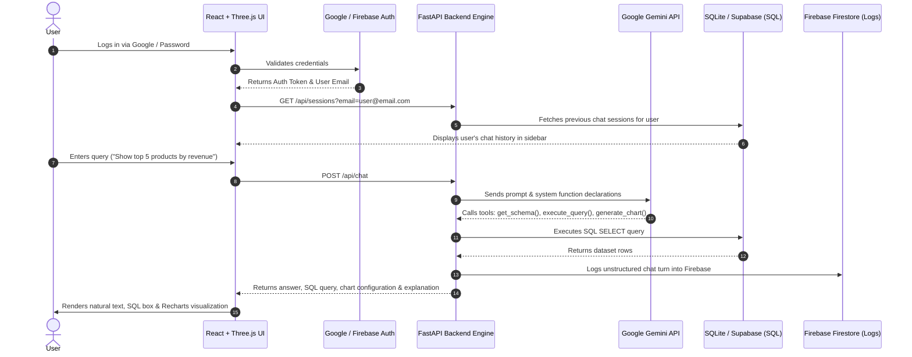

# 🚀 TechX AI — Intelligent LLM Database & Visual Analytics Platform

> **TechX AI** is an enterprise-grade conversational AI platform that connects natural language queries with relational databases (SQLite, Supabase PostgreSQL) and NoSQL stores (Firebase Firestore). It features automated SQL query generation, real-time 2D/3D visual analytics, interactive ER diagrams, persistent user chat sessions, and Google OAuth authorization.

---

## 📸 What is in this Website?

TechX AI provides a full-suite intelligent interface designed for data engineers, analysts, and business users:

1. 💬 **AI SQL & Analytics Agent Chat**
   - Translate plain text questions (e.g., *"Show me top 5 products by revenue this quarter"*) into executable SQL queries with step-by-step reasoning logs.
   - Live rendering of interactive **Bar, Line, Pie, and Scatter charts** generated on the fly.

2. 📊 **Interactive ER Diagram & Process Flowchart Generator**
   - Automatically draw database Entity-Relationship (ER) diagrams and business workflow pipelines using **Mermaid.js**.

3. 🗄️ **Schema Explorer & Data Inspector**
   - Browse database tables, inspect column data types, foreign keys, and preview raw data rows directly in an interactive modal.

4. 📌 **Personalized Analytics Dashboard**
   - Pin generated charts from chat sessions directly to a persistent dashboard for monitoring key performance metrics.

5. 🗂️ **Multi-User Chat Session Management**
   - User-filtered conversation history sidebar with search functionality and **one-click session deletion** (synced with the backend database).

6. 🎨 **3D Interactive Backdrop**
   - Built with **Three.js** depth effects synchronized with camera movement and scroll offset for a premium visual aesthetic.

---

## 🔄 System Architecture & User Flow

Here is how data flows through TechX AI when a user interacts with the chatbot:



---

## 🛠️ Applications of Integrations & APIs

TechX AI leverages a modern multi-database and multi-cloud architecture:

### 1. 🧠 **Google Gemini API** (`GEMINI_API_KEY`)
* **Role**: Primary LLM Reasoning Engine.
* **Function**: Executes **Structured Function Calling** (`get_schema`, `execute_query`, `generate_chart`, `generate_flowchart`, `explain_data`). Converts natural language into safe, read-only SQL queries and structured JSON chart configurations.

### 2. 🔐 **Google OAuth 2.0** (`GOOGLE_CLIENT_ID`)
* **Role**: User Authentication & Authorization.
* **Function**: Enables seamless **Google One-Tap / Single Sign-On (SSO)**, allowing users to log in securely without creating separate passwords.

### 3. 🔥 **Firebase Authentication & Firestore** (`FIREBASE_PROJECT_ID`)
* **Role**: Security & Unstructured Audit Logging.
* **Function**:
  * **Firebase Auth**: Secures password hashing and token management for email/password user logins.
  * **Firestore NoSQL**: Stores unstructured document logs (`login_logs` and `chat_logs`) for security auditing, tracking user activity, client IPs, and query metrics.

### 4. ⚡ **Supabase PostgreSQL** (`SUPABASE_URL` & `SUPABASE_KEY`)
* **Role**: Cloud Relational Database Engine.
* **Function**: Centralized cloud database for managing enterprise domain data, user account metadata, synced credentials, and multi-tenant user permissions.

### 5. 💾 **SQLite Local Engine** (`ecommerce.db` & `app_state.db`)
* **Role**: High-speed Local Persistence.
* **Function**:
  * `ecommerce.db`: Stores e-commerce domain tables (Customers, Orders, Products, Categories, Inventory, Order Items, Reviews).
  * `app_state.db`: Manages user chat sessions (`chat_sessions`) and message turns (`chat_messages`).

---

## 🔑 Environment Variables Setup (`.env`)

Create a `.env` file in the root directory (and inside `backend/.env`):

```env
# 1. Google Gemini LLM API Key
GEMINI_API_KEY=your_gemini_api_key_here

# 2. Google OAuth Client ID
GOOGLE_CLIENT_ID=your_google_client_id.apps.googleusercontent.com

# 3. Supabase Cloud Database Credentials
SUPABASE_URL=https://your-project-id.supabase.co
SUPABASE_KEY=your_supabase_anon_key_here

# 4. Firebase Project ID
FIREBASE_PROJECT_ID=your-firebase-project-id

# 5. Security & Application Settings
SECRET_KEY=techx-secret-key-3d-agent-2026
DATABASE_PATH=ecommerce.db
APP_DB_PATH=app_state.db

# 6. Host Ports
PORT=8000
FRONTEND_URL=http://localhost:5173
```

---

## ⚡ Quick Start Guide

### 1. Prerequisites
* **Python 3.10+**
* **Node.js 18+** and `npm`

### 2. Start the Backend API Server
```bash
# Navigate to backend directory
cd backend

# Install Python dependencies
pip install -r requirements.txt

# Launch FastAPI server (runs at http://localhost:8000)
python main.py
```

### 3. Start the Frontend Application
```bash
# Navigate to frontend directory
cd frontend

# Install Node dependencies
npm install

# Start Vite dev server (runs at http://localhost:5173)
npm run dev
```

---

## 📁 Repository Structure

```
llm sql/
├── backend/
│   ├── main.py                # FastAPI endpoints (/api/chat, /api/sessions, /api/schema, etc.)
│   ├── agent.py               # LLM Agent function calling & local orchestrator fallback
│   ├── db.py                  # SQLite app state & chat history connection manager
│   ├── auth.py                # Google OAuth verification & JWT generator
│   ├── multi_db.py            # Supabase PostgreSQL & Firebase Firestore manager
│   ├── seed_db.py             # E-commerce domain database seeder
│   └── tools/                 # Agent function tools (schema, query, chart, diagram, explain)
├── frontend/
│   ├── src/
│   │   ├── App.jsx            # Main React layout, chat session manager & sidebar
│   │   ├── components/        # ChatMessage, ThreeCanvas, SchemaExplorer, DashboardView
│   │   └── index.css          # Design system, glassmorphism & Tailwind styles
│   ├── package.json
│   └── vite.config.js
├── .env                       # Secrets (API keys & Project IDs - gitignored)
├── .env.example               # Environment variables blueprint
└── .gitignore                 # Protected files rule list
```

---

## 📜 License
This project is licensed under the [MIT License](file:///c:/Users/ABHIJIT/OneDrive/Documents/llm%20sql/LICENSE) — see the LICENSE file for details.

