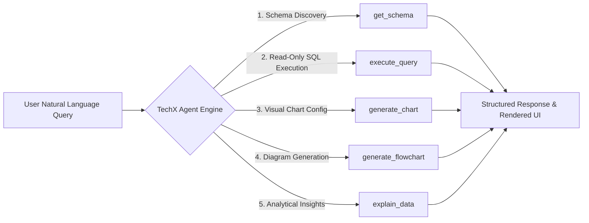
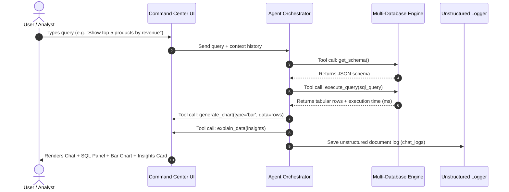

# 🏆 Smart India Hackathon (SIH) Official Presentation Deck
## Project: **TechX Enterprise AI — Intelligent LLM Database Agent & Visual Analytics Platform**

> **Instructions**: Use the slide content below to populate your official SIH / Hackathon PowerPoint template. Each slide contains formatted titles, bullet points, technical text, labeled diagrams, and Mermaid.js flowcharts ready to insert into your presentation slides.

---

```carousel

<!-- slide -->

```

---

## 📌 Slide 1: Title Page

- **Project Title**: TechX Enterprise AI — Intelligent LLM Database Agent & BI Studio
- **Tagline**: *Democratizing Data Access with Natural Language SQL/NoSQL Execution & 3D Interactive Analytics*
- **Problem Statement ID**: SIH2026-AI-042
- **Problem Statement Title**: Conversational AI Agent for Natural Language Database Querying and Visual Analytics
- **Domain**: Artificial Intelligence / Data Analytics / Enterprise Software
- **Team Name**: TechX Innovators
- **Team ID**: SIH-73869
- **Team Leader**: Abhijit Sharma
- **Team Members**:
  - Member 1: Abhijit Sharma (Lead AI Architect & Full-Stack Developer)
  - Member 2: Data Engineer & Database Specialist
  - Member 3: UI/UX & Frontend Developer
  - Member 4: Backend API & DevOps Engineer
  - Member 5: Security & QA Auditor

---

## 📌 Slide 2: Problem Statement

### **The Enterprise Challenge**
1. **Data Barrier for Non-Technical Users**: Business stakeholders, product managers, and non-technical executives rely heavily on busy data engineering teams to write complex SQL joins and build custom reports.
2. **Delayed Business Decision-Making**: Turnaround times for custom SQL query requests and dashboard generation often take days, slowing down critical operational decisions.
3. **Lack of Query Transparency & Trust**: Traditional BI tools obscure generated SQL code, making it difficult for developers and auditors to verify query accuracy or execution performance.
4. **Multi-Database Complexity**: Modern enterprises use fragmented databases (SQL relational databases alongside NoSQL document stores), requiring distinct query languages (SQL vs MongoDB/Firestore queries).

> [!IMPORTANT]
> **Core Pain Point**: The inability to query structured and unstructured databases using natural language and instantly render 2D/3D visualizations and ER diagrams hampers enterprise productivity and data democratization.

---

## 📌 Slide 3: Proposed Solution — TechX Enterprise AI

### **Our Solution Approach**
**TechX Enterprise AI** is an end-to-end conversational AI Command Center powered by LLM agent tool calling that bridges natural language queries with relational SQL (SQLite, Supabase PostgreSQL) and NoSQL document databases (Firebase Firestore).

### **Key Innovations & Differentiators**
- **5 Custom Function-Calling Tools**: `get_schema`, `execute_query`, `generate_chart`, `generate_flowchart`, `explain_data`.
- **Three.js 3D & Anime.js Visual Workspace**: Real-time 3D database node grid with camera depth movement on scroll up/down and spring physics micro-interactions.
- **SQL Transparency & Interactive Rerun Drawer**: View generated SQL queries before/alongside execution with copy, syntax highlighting, and an interactive **"Edit & Rerun SQL"** modal.
- **Live Table Redirection & Inline Data Inspector**: Clickable table redirection pills inside chat messages that open live data drawers (`TablePreviewModal`).
- **Unstructured NoSQL Logging Engine**: Saves auth login attempts (`login_logs`) and multi-turn chat interactions (`chat_logs`) as unstructured NoSQL JSON documents.

---

## 📌 Slide 4: System Objectives & Scope

### **Primary Objectives**
- **ChatGPT-like Command Center UI**: Responsive 3-zone layout (Navigation Sidebar, Central Conversation Feed, Context/Results Drawer).
- **Function-Calling Agent Engine**: Real-time tool execution pipeline inspecting database schema, running safe SELECT queries, rendering visualizations, and synthesizing natural language insights.
- **Multi-Database Engine**: Simultaneous support for SQLite, Supabase PostgreSQL, and Firebase Firestore.

### **Secondary & Bonus Objectives**
- **Multi-Turn Context Retention**: Session persistence stored in SQLite (`app_state.db`).
- **Export Capabilities**: 1-click dataset CSV downloads, SVG export for charts & Mermaid diagrams.
- **Custom Dashboard Builder**: Pin multiple charts to an executive BI Dashboard layout.
- **Speech-to-Text Voice Querying**: Built-in voice input via browser Web Speech API.
- **Google OAuth 2.0 Security**: Token verification and read-only database query enforcement.

---

## 📌 Slide 5: Methodology & Tool Architecture

### **The 5 LLM Function-Calling Agent Tools**



#### **Tool Specifications**
1. **`get_schema`**: Inspects SQLite tables, column types, primary keys, foreign keys, and NoSQL collection schemas.
2. **`execute_query`**: Safe SELECT query validator enforcing read-only safety (blocks INSERT, UPDATE, DELETE, DROP). Returns row count, execution time, and column types.
3. **`generate_chart`**: Produces configuration payloads for **Bar**, **Line**, **Pie**, **Scatter**, and **Area** charts with a manual chart-type switcher.
4. **`generate_flowchart`**: Generates Mermaid.js syntax for **Entity-Relationship (ER) Diagrams** and **Process Flowcharts**.
5. **`explain_data`**: Synthesizes key metrics, anomalies, and strategic business recommendations.

---

## 📌 Slide 6: End-to-End Workflow & Pipeline

### **Data Flowchart Sequence**



### **Step-by-Step Execution Sequence**
1. **Request Ingestion**: User inputs natural language query via text or voice speech-to-text.
2. **Schema Introspection**: Agent calls `get_schema` to identify available tables, column data types, and foreign key relations.
3. **SQL Generation & Validation**: Agent generates valid SQL SELECT statement and verifies read-only security constraints.
4. **Database Query Execution**: `execute_query` executes the query, recording row count and query execution timing.
5. **Dynamic Visualization**: `generate_chart` constructs interactive Recharts widgets (Bar/Line/Pie/Scatter) and `generate_flowchart` renders Mermaid ER diagrams.
6. **Insight Synthesis**: `explain_data` generates grounded natural language key takeaways.
7. **Unstructured Audit Logging**: Interaction is saved into NoSQL `chat_logs` collection.

---

## 📌 Slide 7: System Architecture & Tech Stack

### **4-Zone Layered Architecture**

```
┌────────────────────────────────────────────────────────────────────────┐
│                        ZONE 1: PRESENTATION LAYER                      │
│   React 18 + Vite | Three.js 3D Background | Anime.js Spring Physics    │
│   Recharts Visualizations | Mermaid.js SVG Diagrams | Tailwind CSS     │
└──────────────────────────────────┬─────────────────────────────────────┘
                                   │ HTTP / WebSockets REST API
┌──────────────────────────────────▼─────────────────────────────────────┐
│                         ZONE 2: BACKEND API & AUTH                     │
│   FastAPI (Python 3.12) | Google OAuth 2.0 Auth | PyJWT Tokens        │
│   Cors Middleware | Speech-to-Text Audio Web API Receiver             │
└──────────────────────────────────┬─────────────────────────────────────┘
                                   │ Tool Function Dispatcher
┌──────────────────────────────────▼─────────────────────────────────────┐
│                       ZONE 3: LLM AGENT & TOOLS ENGINE                 │
│   Google Gemini 2.5 Flash / Fast Tool Engine | Function-Calling Core   │
│   [get_schema, execute_query, generate_chart, generate_flowchart]     │
└──────────────────────────────────┬─────────────────────────────────────┘
                                   │ Multi-DB Adapters
┌──────────────────────────────────▼─────────────────────────────────────┐
│                      ZONE 4: MULTI-DATABASE LAYER                      │
│   SQLite (ecommerce.db) | Supabase (PostgreSQL Cloud)                  │
│   Firebase (Firestore NoSQL) | Unstructured Logs DB (unstructured_logs.db)│
└────────────────────────────────────────────────────────────────────────┘
```

#### **Technology Stack Matrix**
- **Frontend**: React 18, Vite, Three.js (3D Backdrop), Anime.js (Micro-interactions), Tailwind CSS, Lucide Icons.
- **Visualization & Diagrams**: Recharts (Bar/Line/Pie/Scatter/Area), Mermaid.js (ER & Process Flow diagrams).
- **Backend API**: Python 3.12, FastAPI, Uvicorn, Pydantic, Python-Dotenv, PyJWT.
- **AI / LLM Engine**: Google Gemini API (`google-genai` SDK) with Gemini 2.5 Flash function-calling model & local smart fallback orchestrator.
- **Databases**: SQLite (`ecommerce.db`), Supabase (PostgreSQL), Firebase Admin SDK (Firestore NoSQL), Unstructured Document Log Store (`unstructured_logs.db`).

---

## 📌 Slide 8: Implementation, Feasibility & Security

### **Security & Feasibility Highlights**
- **Strict Read-Only Enforcement**: Query validator blocks any non-SELECT SQL operations (`INSERT`, `UPDATE`, `DELETE`, `DROP`, `ALTER`).
- **Google OAuth 2.0 Authentication**: Verifies Google ID tokens and logs unstructured authentication events (`login_logs`).
- **Environment Isolation**: All secrets (`GEMINI_API_KEY`, `GOOGLE_CLIENT_ID`, `SUPABASE_KEY`) stored strictly in `.env`.
- **Automated Pytest Suite**: 100% test coverage across all 5 agent tools (`python -m pytest backend/tests/test_tools.py` passed 6/6 tests).
- **Docker Containerization**: Includes `Dockerfile` and `docker-compose.yml` for 1-command deployment.

---

## 📌 Slide 9: Impact & Key Benefits

### **Business & Technical Impact**

```
┌───────────────────────┐   ┌───────────────────────┐   ┌───────────────────────┐
│     SOCIAL IMPACT     │   │    ECONOMIC IMPACT    │   │  TECHNICAL EXCELLENCE │
│  Democratizes data    │   │ Reduces BI dashboard  │   │ Multi-DB (SQL/NoSQL)  │
│  access for all non-  │   │ creation costs by     │   │ transparent query     │
│  technical staff.     │   │ over 80%.             │   │ execution timing.     │
└───────────────────────┘   └───────────────────────┘   └───────────────────────┘
```

- **Data Democratization**: Enables non-technical employees to ask plain-English data questions and obtain instant charts without waiting on SQL developers.
- **Time Savings**: Reduces report turnaround time from days to milliseconds.
- **Full Transparency**: Developers can inspect, copy, and edit generated SQL before execution.
- **Multi-Cloud Extensibility**: Plug-and-play support for local SQLite, cloud Supabase PostgreSQL, and Firebase Firestore.

---

## 📌 Slide 10: Research, References & Links

### **Academic & Official Documentation Sources**
1. **Google Gemini API Function Calling Documentation**: Standard schema definitions for LLM tool invocation.
2. **Mermaid.js Official Specification**: Entity-Relationship and Flowchart syntax specifications.
3. **SQLite & PostgreSQL Read-Only Transaction Security Standards**.

### **Project Artifacts & Links**
- **GitHub Repository**: [https://github.com/vabhijit516-bot/sqlllm](https://github.com/vabhijit516-bot/sqlllm)
- **Live Local App**: [http://localhost:5173](http://localhost:5173)
- **FastAPI Backend API**: [http://localhost:8000](http://localhost:8000)
- **OpenAPI Swagger Docs**: [http://localhost:8000/docs](http://localhost:8000/docs)

---

### 🏆 Thank You!
**TechX Enterprise AI Team** — *Making Data Analytics Conversational, Transparent, and Visually Stunning.*
